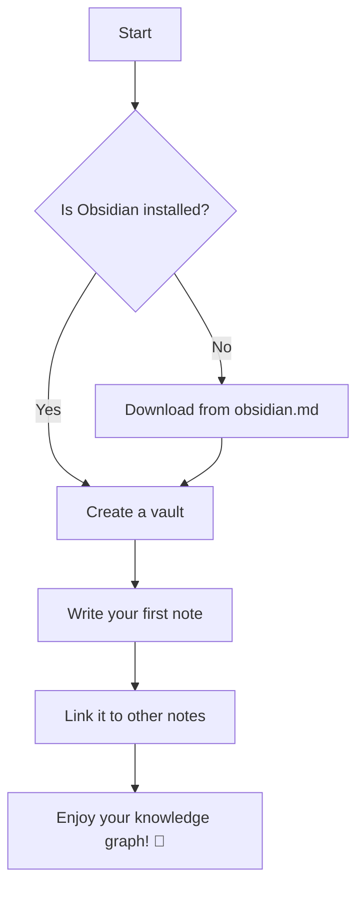
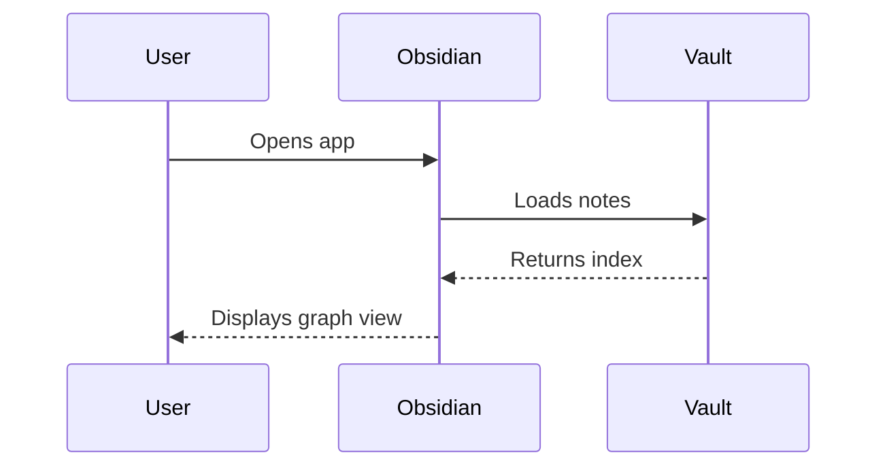

# Obsidian:features

🧠 My Knowledge Base — Obsidian Features Demo

Welcome to this **Obsidian-flavored Markdown** showcase. This note demonstrates the most important features you can use in your vault.

---

## 📝 Basic Text Formatting

You can write *italic*, **bold**, and ~~strikethrough~~ text inline.

Use `inline code` for technical terms or short snippets.

For highlighted text use ==this syntax== to mark important concepts.

---

## 🔗 Links

#### Internal Links (Wikilinks)

Link to another note in your vault:

- [[Getting Started]]
- [[Projects/Project Alpha]]
- [[Daily Notes/2024-03-10]]

Link with a custom display label:

- [[Getting Started|Click here to begin]]
- [[Projects/Project Alpha|Alpha Project Overview]]

Link to a specific heading inside another note:

- [[Getting Started#Installation]]
- [[Getting Started#Installation|How to Install]]

Link to a specific block:

- [[Daily Notes/2024-03-10#^abc123]]

#### External Links

- [Obsidian Official Site](https://obsidian.md)
- [Markdown Guide](https://www.markdownguide.org)
- [My Favorite Search Engine](https://duckduckgo.com)

---

## 🖼️ Images

#### External Image


#### Internal Image (from your vault)

![[my-screenshot.png]]

#### Internal Image with custom size

![[my-screenshot.png|400]]

#### External Image with alt text and custom size


---

## 📋 Tables

| Feature         | Supported | Notes                          |
|----------------|-----------|-------------------------------|
| Wikilinks       | ✅        | Core Obsidian feature          |
| Backlinks       | ✅        | Automatic graph generation     |
| Dataview        | ✅        | Requires community plugin      |
| Tags            | ✅        | Use `#tag` syntax              |
| Embeds          | ✅        | Notes, images, audio, video    |
| Canvas          | ✅        | Visual note mapping            |

---

## ✅ Task Lists

- [x] Install Obsidian
- [x] Create your first note
- [ ] Set up daily notes template
- [ ] Explore community plugins
- [ ] Configure graph view

---

## 🏷️ Tags

You can add tags inline anywhere in a note: #productivity #knowledge-management #obsidian

Or use front matter tags (see YAML section below).

---

## 🔢 Ordered and Unordered Lists

Unordered:

- Apples
- Oranges
  - Navel oranges
  - Blood oranges
- Bananas

Ordered:

1. Open Obsidian
2. Create a new vault
3. Add your first note
4. Link it to another note

---

## 💻 Code Blocks

```python
def greet(name: str) -> str:
return f"Hello, {name}! Welcome to Obsidian."

print(greet("World"))
```

```javascript
const vault = {
name: "My Knowledge Base",
notes: 142,
tags: ["productivity", "writing", "research"],
};

console.log(`Vault: ${vault.name} — ${vault.notes} notes`);
```

---

## 📐 Math (LaTeX)

Inline math: $E = mc^2$

Block math:

$$
\int_{-\infty}^{\infty} e^{-x^2} dx = \sqrt{\pi}
$$

$$
\frac{d}{dx}\left( \int_{a}^{x} f(t)\,dt \right) = f(x)
$$

---

## 💬 Blockquotes

> "The mind is not a vessel to be filled, but a fire to be kindled."
> — Plutarch

Nested blockquotes:

> This is the outer quote.
>
> > And this is a nested quote inside it.

---

## 📎 Embeds

#### Embed another note entirely

![[Getting Started]]

#### Embed a specific section of a note

![[Getting Started#Installation]]

#### Embed a specific block

![[Daily Notes/2024-03-10#^abc123]]

#### Embed a PDF

![[research-paper.pdf]]

#### Embed audio

![[voice-memo.mp3]]

#### Embed video

![[screen-recording.mp4]]

---

## 🗒️ Footnotes

Obsidian supports footnotes[^1] which are rendered at the bottom of the note[^2].

[^1]: This is the first footnote. You can put detailed references here.
[^2]: Footnotes support **bold**, *italic*, and even `code`.

---

## 😀 Emojis

Obsidian renders emojis natively — just paste them in:

🚀 📚 💡 🎯 🔥 ✨ 🧠 📝 🗂️ 🔗 🌐 📊 🎨 🛠️ ⚙️

---

## 📊 Mermaid Diagrams





---

## 🔖 Block IDs

You can reference specific paragraphs using block IDs. ^my-special-block

This block above has the ID `my-special-block` and can be linked with `[[this-note#^my-special-block]]`.

---

## ↔️ Horizontal Rules

Three or more dashes create a horizontal divider:

---

---

## 🗃️ Definition Lists (via HTML)

<dl>
<dt>Vault</dt>
<dd>A folder on your computer that Obsidian uses to store all your notes.</dd>

<dt>Wikilink</dt>
<dd>A double-bracket link <code>[[like this]]</code> that connects notes together.</dd>

<dt>Backlink</dt>
<dd>A reference shown in a note that tells you which other notes link to it.</dd>
</dl>

---

## 📅 YAML Front Matter

```yaml
---
title: Obsidian Features Demo
date: 2024-03-10
tags:
  - obsidian
  - markdown
  - productivity
author: Claude
status: complete
aliases:
  - Obsidian Demo
  - Markdown Features
---
```

---

## 🧩 Callouts (Admonitions)

> [!NOTE]
> This is a note callout. Great for supplementary information.

> [!TIP]
> Pro tip: Use `Cmd/Ctrl + P` to open the command palette quickly.

> [!WARNING]
> Be careful when deleting notes — links may break!

> [!DANGER]
> This action cannot be undone. Proceed with caution.

> [!INFO] Custom Title Here
> Callouts can have custom titles too.

> [!SUCCESS]
> Your vault has been synced successfully! 🎉

---


*Last updated: 2024-03-10 · Made with ❤️ in Obsidian*