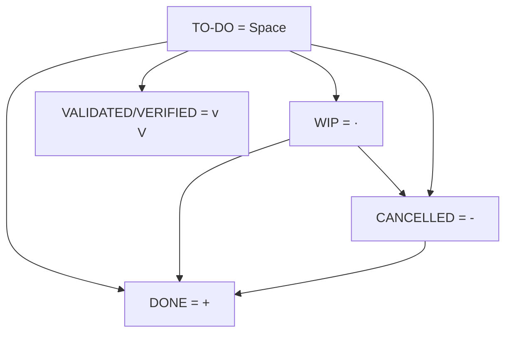

# PENMARK

Handwriting-first markup language. From paper to Markdown and CSV via OCR.

**PERMANENT WORKFLOW + FAT32**

100% permanent and FAT32 filesystem compatible.

- [ ] 1. TO-DO -- `[ ]` - Markdown default
- [·] 2- WIP -- `[·]` - Medium Dot
- [-] 3. CANCELLED -- `[-]` - Hyphen
- [+] 4. DONE -- `[+]` - Plus

**ERASABLE + FAT32**

- [x] DONE -- `[x]` - Lowercase x
- [_] TO-DO - `[_]` - Space
- [v] VALIDATED/VERIFIED -- `[v]` - Lowercase v

**FALLBACK COMPATIBLE - OCR fail detections uppercases**

- [.] WIP -- `[.]` - Dot
- [X] DONE -- `[X]` - Uppercase X
- [V] VALIDATED/VERIFIED -- `[V]` - Uppercase V

**Not FAT32 compatible**

- [/] INCOMPLETE -- `[/]` - Forward slash

---

**OBSIDIAN-THINGS (Theme)**

**Obsidian-Things - Basic**

- [_] to-do -- `[_]`
- [/] incomplete -- `[/]`
- [x] done -- `[x]`
- [-] canceled -- `[-]`
- [>] forwarded -- `[>]`
- [<] scheduling -- `[<]`

**Obsidian-Things - Extras**

- [?] question -- `[?]`
- [!] important -- `[!]`
- [*] star -- `[*]`
- ["] quote -- `["]`
- [l] location -- `[l]`
- [b] bookmark -- `[b]`
- [i] information -- `[i]`
- [S] savings -- `[S]`
- [I] idea -- `[I]`
- [p] pros -- `[p]`
- [c] cons -- `[c]`
- [f] fire -- `[f]`
- [k] key -- `[k]`
- [w] win -- `[w]`
- [u] up -- `[u]`
- [d] down -- `[d]`

**Obsidian-Things - Developer Extras**

- [D] draft pull request -- `[D]`
- [P] open pull request -- `[P]`
- [M] merged pull request -- `[M]`

---

**Diagram - Basic**

---

**Problematic**

- [_] [\] INCOMPLETE -- `[\]` - Backslash

---

**Notes**

- Medium Dot is FAT32 compatible via LFN (Long File Names, Unicode) -> Alt + 0149

